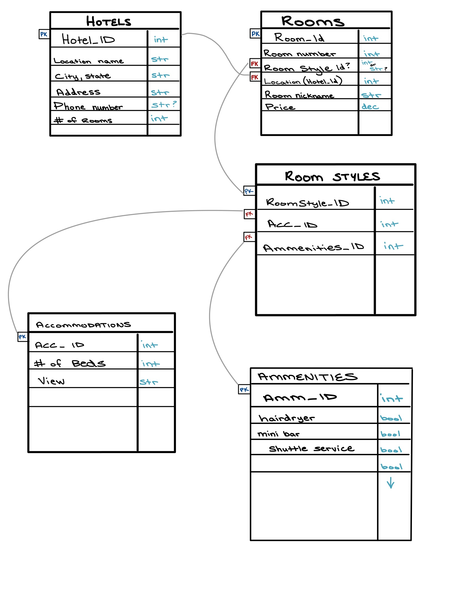
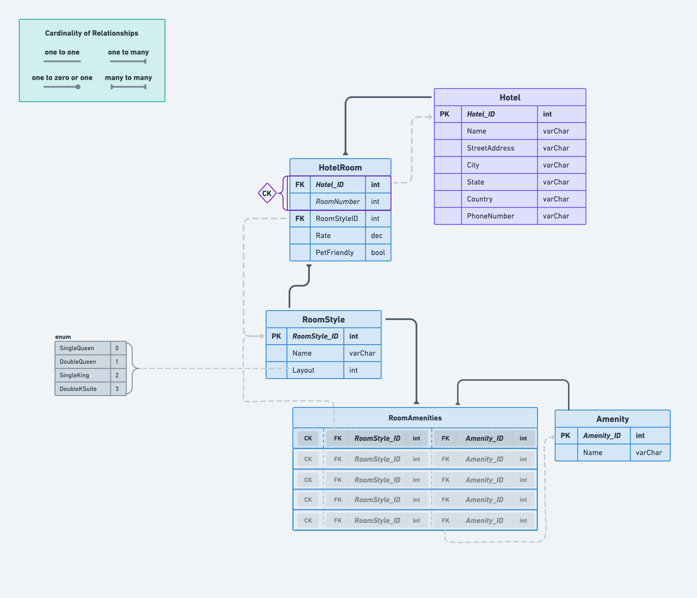

# Async Inn - ERD & Explanations

> ## [Home](../README.md)
>
> ### [Lab 11](Lab11.md)

---

> To the best of your ability, create a system design of a `database ERD diagram` that meets all of the requirements below.
>
> The diagram should take all of the requirements into consideration and allow a baseline for starting the creation of the web application.

---

### Build your ERD (Entity Relationship Diagram) so that it has at least

- (1) Joint Entity Table with Payload
- (1) Pure Join Table
- (1) Enum

### Within your ERD identify/label the following as necessary

- Primary Keys
- Foreign Keys
- Composite Keys (where they exist)
- Navigation Properties (What other entities are related? Why?)
- Relationships between tables (1:1, 1:Many, Many:1, Many:Many etc…)

> ---

### In a external document, please provide an explanation of the components in your database ERD diagram

> The ERD Design is attempt based. Submit, before the next class start, a healthy attempt on the database design must be completed with all of the required details described.
>
> You may work together and collaborate on this ERD, but everyone is responsible for turning in their own DB diagram and explanation. 2-3 sentences for each table is sufficient for an explanation.
>
> Your ERD diagram must be digital. You may take a picture of your diagram from a white board, but if you decide to stick with your db diagram, and not use the solution provided for your web application, you will be required to transfer your white board image into a cleaner format.

---

## ERD Version 1.0

---

## ERD Version 2.0 / Final

---

## Tables

### Hotel

- This is the main/parent table, which represents the individual hotel buildings and each one’s associated attributes.
  - **Keys**:
    - Primary Key: “*Hotel_ID*”
  - **Attributes**:
    - *Name*, *StreetAddress*, *City*, *State*, *Country*, *PhoneNumber*
    - All the varchar data type, because they will be strings which each vary in length.
  - **Relationships**:
    - *HotelRoom* - One to Many; For each Hotel, there will be several Hotel Rooms.

> ---

### HotelRoom

- **Keys**:
  - Primary Key: A composite key of the attribute: “*RoomNumber*”, plus the foreign key: “*Hotel_ID*”.
  - Foreign Key: “*RoomStyle_ID*”
- **Attributes**:
  - *RoomNumber* - int
  - *Rate* - decimal, to represent the price of the room per night, etc.
  - *PetFriendly* - bool, states whether or not the room allows pets.
- **Relationships**:
  - *RoomStyle* - Many to One; Each Hotel Room will have one Room Style, but that Room Style could apply to several different Hotel Rooms.

> ---

### RoomStyle

- Contains the options available for room accommodations, such as the size and number of beds in the room.
  - **Keys**:
    - Primary Key: “*RoomStyle_ID*”
  - **Attributes**:
    - *Name* - varchar; Novelty nickname to easily identify each room layout. Such as “*Seahawks Snooze*” and “*Restful Rainier*”.
    - *Layout* - int, represents one option from an enum of several possible layout options.
  - **Relationships**:
    - *RoomAmenities* - One to Many; Each room style will have a varying amount of possible amenities.

> ---

### Amenity

- Contains all of the possible amenities that each room could have.
  - **Keys**:
    - Primary Key: “*Amenity_ID*”
  - **Attributes**:
    - *Name* - varchar; What the amenity itself is (minibar, hairdryer, coffee maker, etc.)
  - **Relationships**:
    - *RoomAmenities* - One to Many; Each amenity can be listed for multiple rooms, but those rooms will only have that amenity specified once.

> ---

### RoomAmenities

- This is the **PURE JOIN** table. It is to keep track of which rooms have which amenities available, and that’s it. (No Payload)
- Each row contains one composite key, made up of one “*RoomStyle_ID*”, plus one “*Amenity_ID*”.

---
