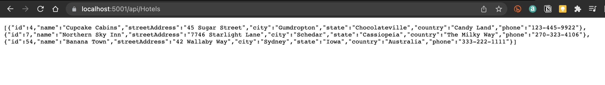
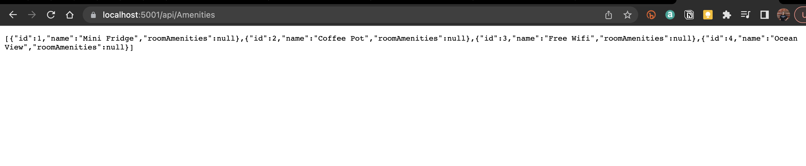
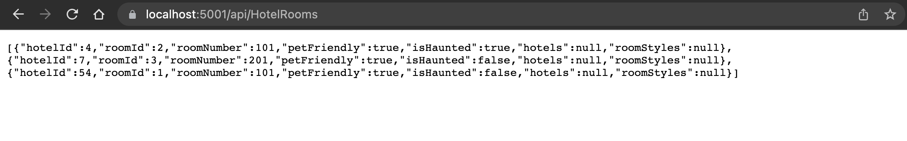
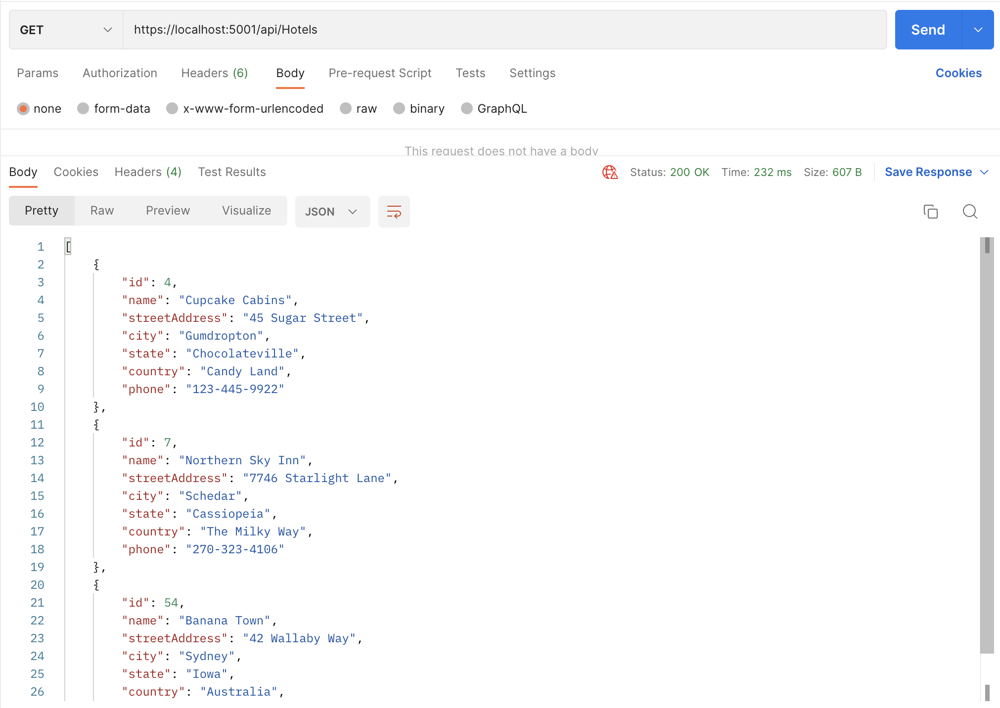
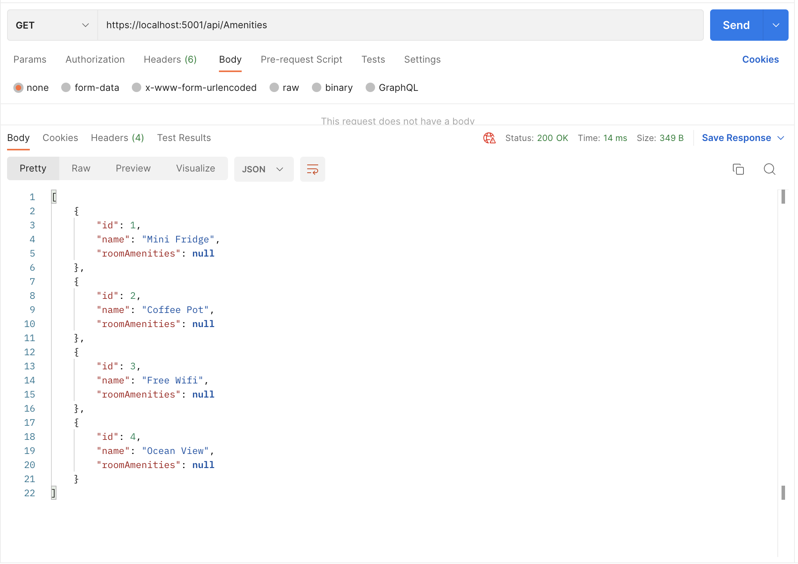
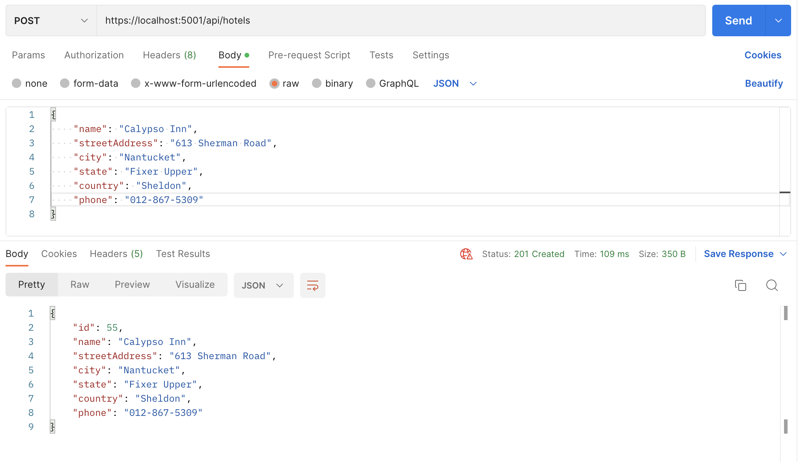
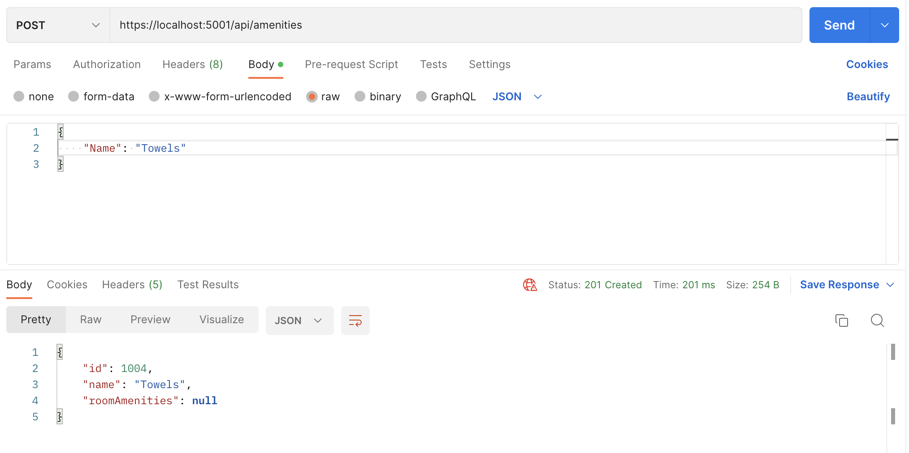
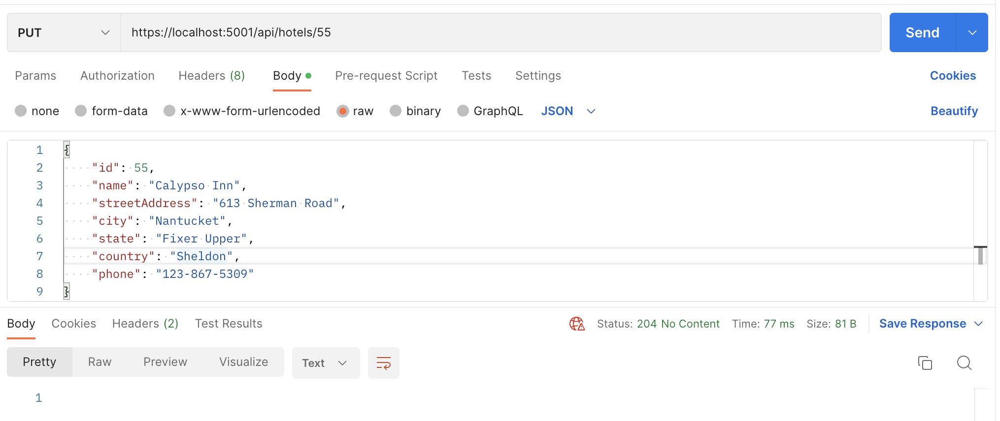
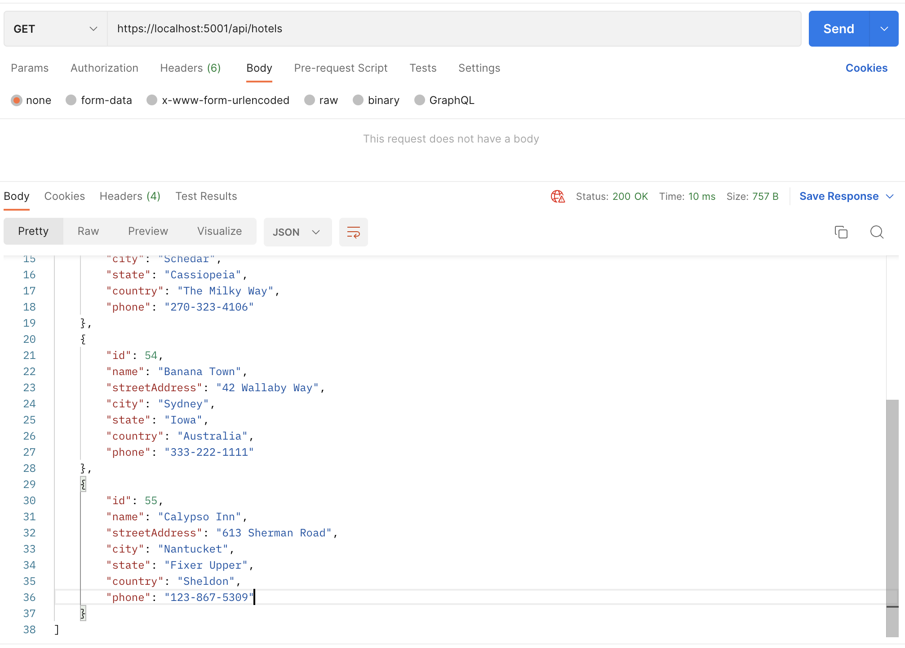

# Async Inn

## Lab 12 - Testing CRUD in Postman

> ## [Home](../README.md)
>
> ### [Lab 12](Lab12.md)

---

### **Live** - *localhost/api/...*

---

## **GET**

### *Hotels*

### *Amenities*

### *Hotel Rooms*

---

### **POST**

### *Hotel*

### *Amenity*

---

### **PUT**

### *Hotel*

---
